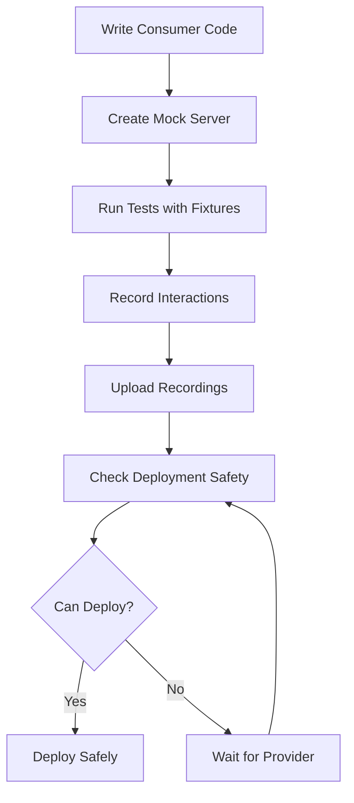

As a **consumer**, you depend on APIs provided by other services. Entente helps you test against realistic mock servers created from provider OpenAPI specifications, while automatically recording your interactions for provider verification.

## Overview

Consumer testing in Entente follows this workflow:



## Quick Start for Consumers

Here's how to get started as a consumer using our castle-client example:

### 1. Install Dependencies

```bash
npm install @entente/consumer @entente/types
# Install CLI globally for deployment commands
npm install -g @entente/cli
```

### 2. Create Consumer Test

```typescript
// test/consumer.test.ts
import { readFileSync } from 'node:fs'
import { join } from 'node:path'
import { createClient } from '@entente/consumer'
import type { Fixture } from '@entente/types'
import { afterAll, beforeAll, describe, expect, it } from 'vitest'
import { CastleApiClient } from '../src/castle-api.js'

describe('Castle Client Consumer Contract Tests', () => {
  let client: ReturnType<typeof createClient>
  let mock: Awaited<ReturnType<typeof client.createMock>>
  let castleApi: CastleApiClient

  beforeAll(async () => {
    // Load local fixtures for deterministic testing
    const fixturesPath = join(process.cwd(), 'fixtures', 'castle-service.json')
    const localFixtures: Fixture[] = JSON.parse(readFileSync(fixturesPath, 'utf-8'))

    client = createClient({
      serviceUrl: process.env.ENTENTE_SERVICE_URL || '',
      apiKey: process.env.ENTENTE_API_KEY || '',
      consumer: 'castle-client',
      environment: 'test',
      recordingEnabled: process.env.CI === 'true', // Record in CI only
    })

    // Create mock server from provider's OpenAPI spec
    mock = await client.createMock('castle-service', '0.1.0', {
      useFixtures: true,
      validateRequests: true,
      validateResponses: true,
      localFixtures,
    })

    // Initialize your API client with the mock URL
    castleApi = new CastleApiClient(mock.url)
  })

  afterAll(async () => {
    if (mock) {
      await mock.close() // This uploads any recorded interactions
    }
  })

  it('should get all castles from the service', async () => {
    const castles = await castleApi.getAllCastles()

    expect(Array.isArray(castles)).toBe(true)
    expect(castles.length).toBeGreaterThan(0)

    const castle = castles[0]
    expect(castle).toHaveProperty('id')
    expect(castle).toHaveProperty('name')
    expect(castle).toHaveProperty('region')
    expect(castle).toHaveProperty('yearBuilt')

    expect(typeof castle.id).toBe('string')
    expect(typeof castle.name).toBe('string')
    expect(typeof castle.region).toBe('string')
    expect(typeof castle.yearBuilt).toBe('number')
  })

  it('should create a new castle', async () => {
    const newCastleData = {
      name: 'Château de Test',
      region: 'Test Region',
      yearBuilt: 1500,
    }

    const createdCastle = await castleApi.createCastle(newCastleData)

    expect(createdCastle).toHaveProperty('id')
    expect(createdCastle.name).toBe(newCastleData.name)
    expect(createdCastle.region).toBe(newCastleData.region)
    expect(createdCastle.yearBuilt).toBe(newCastleData.yearBuilt)
  })
})
```

### 3. Run Consumer Tests

```bash
# Run your consumer tests
npm test

# Check deployment safety
entente can-i-deploy \
  --type consumer \
  --service castle-client \
  --service-version 0.1.3 \
  --environment production
```

## Core Concepts

### Mock Server Creation

Entente creates mock servers from provider OpenAPI specifications using Prism:

```typescript
const client = createClient({
  serviceUrl: 'https://entente.company.com',
  apiKey: process.env.ENTENTE_API_KEY,
  consumer: 'castle-client',
  consumerVersion: '0.1.3',
  environment: 'test',
  recordingEnabled: process.env.CI === 'true'
})

const mock = await client.createMock('castle-service', '0.1.0', {
  // Use approved fixtures for deterministic responses
  useFixtures: true,

  // Validate requests match OpenAPI spec
  validateRequests: true,

  // Validate responses match OpenAPI spec
  validateResponses: true,

  // Provide local fixtures for offline development
  localFixtures: loadLocalFixtures(),

  // Use specific port (optional)
  port: 3001
})

console.log(`Mock server running at: ${mock.url}`)
// Use mock.url in your tests
```

### Fixture-Based Testing

Fixtures provide deterministic test data:

```typescript
// fixtures/castle-service.json
[
  {
    "id": "fixture_1",
    "service": "castle-service",
    "serviceVersion": "0.1.0",
    "operation": "listCastles",
    "status": "approved",
    "priority": 2,
    "source": "provider",
    "data": {
      "request": {
        "method": "GET",
        "path": "/castles",
        "headers": { "accept": "application/json" }
      },
      "response": {
        "status": 200,
        "headers": { "content-type": "application/json" },
        "body": [
          {
            "id": "550e8400-e29b-41d4-a716-446655440000",
            "name": "Château de Versailles",
            "region": "Île-de-France",
            "yearBuilt": 1623
          },
          {
            "id": "550e8400-e29b-41d4-a716-446655440001",
            "name": "Château de Fontainebleau",
            "region": "Île-de-France",
            "yearBuilt": 1137
          }
        ]
      }
    }
  }
]
```

### Interaction Recording

When `recordingEnabled: true` (typically in CI), Entente automatically records all interactions:

```typescript
// This interaction will be recorded in CI:
const castles = await fetch(`${mock.url}/castles`).then(r => r.json())

// Recorded interaction includes:
// - Request method, path, headers, body
// - Response status, headers, body
// - Operation ID (from OpenAPI spec)
// - Consumer name and version
// - Environment context
```

### API Client Pattern

Structure your API client for easy testing:

```typescript
// src/castle-api.ts
export class CastleApiClient {
  constructor(private baseUrl: string) {}

  async getAllCastles(): Promise<Castle[]> {
    const response = await fetch(`${this.baseUrl}/castles`)
    if (!response.ok) {
      throw new Error(`Failed to get castles: ${response.statusText}`)
    }
    return response.json()
  }

  async getCastleById(id: string): Promise<Castle> {
    const response = await fetch(`${this.baseUrl}/castles/${id}`)
    if (!response.ok) {
      if (response.status === 404) {
        throw new Error('Castle not found')
      }
      throw new Error(`Failed to get castle: ${response.statusText}`)
    }
    return response.json()
  }

  async createCastle(data: CreateCastleRequest): Promise<Castle> {
    const response = await fetch(`${this.baseUrl}/castles`, {
      method: 'POST',
      headers: { 'Content-Type': 'application/json' },
      body: JSON.stringify(data)
    })
    if (!response.ok) {
      throw new Error(`Failed to create castle: ${response.statusText}`)
    }
    return response.json()
  }
}
```

## Mock Server Features

### Request/Response Validation

Entente validates both requests and responses against the OpenAPI spec:

```typescript
const mock = await client.createMock('castle-service', '0.1.0', {
  validateRequests: true,   // Fail if request doesn't match spec
  validateResponses: true,  // Fail if response doesn't match spec
})

// This request will fail validation:
await fetch(`${mock.url}/castles`, {
  method: 'POST',
  headers: { 'Content-Type': 'text/plain' }, // ❌ Spec requires application/json
  body: 'invalid data'
})
```

### Dynamic vs Fixture-Based Responses

**With Fixtures (Deterministic)**:
```typescript
const mock = await client.createMock('castle-service', '0.1.0', {
  useFixtures: true,
  localFixtures: fixtures
})

// Always returns the same castles from fixtures
const castles = await fetch(`${mock.url}/castles`).then(r => r.json())
```

**Without Fixtures (Dynamic)**:
```typescript
const mock = await client.createMock('castle-service', '0.1.0', {
  useFixtures: false
})

// Returns randomly generated data matching the OpenAPI spec
const castles = await fetch(`${mock.url}/castles`).then(r => r.json())
```

### Error Simulation

Mock servers can simulate error responses defined in the OpenAPI spec:

```typescript
// If fixtures include error responses:
{
  "data": {
    "request": { "method": "GET", "path": "/castles/nonexistent" },
    "response": {
      "status": 404,
      "body": { "error": "not_found", "message": "Castle not found" }
    }
  }
}

// Your test can verify error handling:
await expect(castleApi.getCastleById('nonexistent')).rejects.toThrow('Castle not found')
```

## Local Development Workflow

### 1. Fixture Development

Create local fixtures for offline development:

```bash
# Create fixtures directory
mkdir -p fixtures

# Copy approved fixtures from Entente (requires API access)
entente fixtures list \
  --service castle-service \
  --status approved > fixtures/castle-service.json
```

### 2. Test Development

Write tests that use fixtures:

```typescript
beforeAll(async () => {
  // Load local fixtures
  const localFixtures = JSON.parse(
    readFileSync('./fixtures/castle-service.json', 'utf-8')
  )

  mock = await client.createMock('castle-service', '0.1.0', {
    useFixtures: true,
    localFixtures,
    validateRequests: true,
    validateResponses: true
  })
})
```

### 3. CI Integration

Enable recording in CI environments:

```typescript
const client = createClient({
  serviceUrl: process.env.ENTENTE_SERVICE_URL,
  apiKey: process.env.ENTENTE_API_KEY,
  consumer: 'castle-client',
  environment: 'test',
  recordingEnabled: process.env.CI === 'true' // Only record in CI
})
```

## Package.json Integration

Add convenient scripts for consumer testing:

```json
{
  "scripts": {
    "test": "vitest run test/consumer.test.ts",
    "test:watch": "vitest test/consumer.test.ts",
    "register:consumer": "entente register-service --type consumer --name castle-client --environment test",
    "can-i-deploy": "entente can-i-deploy --type consumer --service castle-client --environment test",
    "deploy:consumer": "entente deploy-service --type consumer --name castle-client --service-version 0.1.3 --environment test"
  }
}
```

## Environment Configuration

Configure different environments for different contexts:

```typescript
const getConfig = () => {
  const baseConfig = {
    serviceUrl: process.env.ENTENTE_SERVICE_URL,
    apiKey: process.env.ENTENTE_API_KEY,
    consumer: 'castle-client',
  }

  if (process.env.NODE_ENV === 'test') {
    return {
      ...baseConfig,
      environment: 'test',
      recordingEnabled: false // Don't record in unit tests
    }
  }

  if (process.env.CI) {
    return {
      ...baseConfig,
      environment: 'development',
      recordingEnabled: true // Record in CI
    }
  }

  return {
    ...baseConfig,
    environment: 'local',
    recordingEnabled: false // Don't record locally
  }
}
```

## What's Next?

- **[Creating Mock Servers](/consumers/mock-servers/)** - Deep dive into mock server creation and configuration
- **[Managing Fixtures](/consumers/fixtures/)** - Learn fixture management and approval workflows
- **[Recording Interactions](/consumers/recording/)** - Understand how interactions are captured and uploaded
- **[GitHub Actions](/consumers/github-actions/)** - Integrate consumer testing into your CI/CD pipeline

## Example Project

The [castle-client](https://github.com/entente-dev/entente/tree/main/examples/castle-client) provides a complete working example of consumer testing with:

- Mock server creation from provider specs
- Fixture-based deterministic testing
- Automatic interaction recording in CI
- GitHub Actions CI/CD integration
- Deployment safety checks

Study this example to understand how all the pieces fit together in a real project.