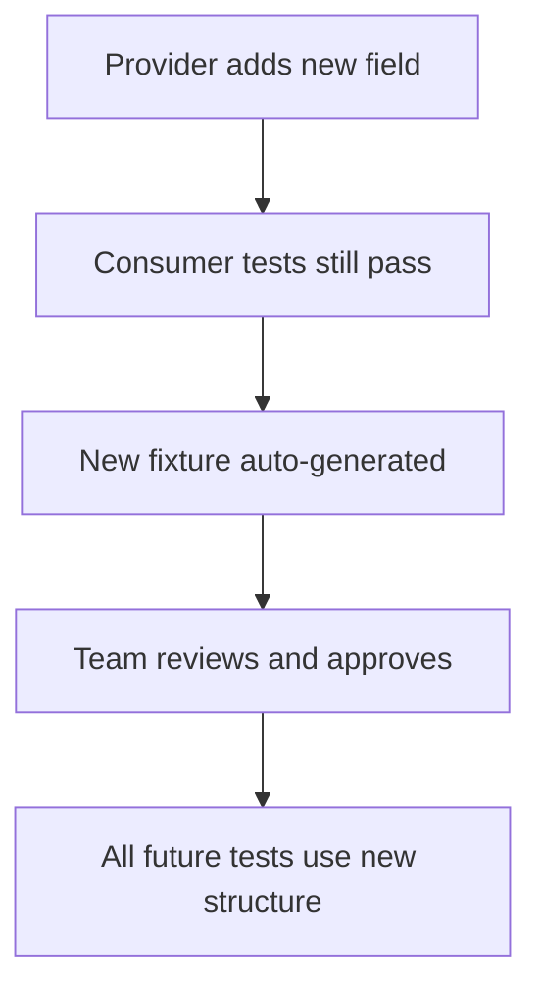

Fixtures are the foundation of deterministic contract testing in Entente. They capture real API interactions and provide consistent, reliable test data for both consumers and providers.

## What are Fixtures?

Fixtures are **recorded API interactions** that include both the request and response data. They serve as test data that makes contract testing deterministic and reliable.

### Fixture Anatomy

A fixture contains complete interaction data:

```json
{
  "id": "fixture_550e8400",
  "service": "castle-service",
  "serviceVersion": "0.1.0",
  "operation": "listCastles",
  "status": "approved",
  "priority": 2,
  "source": "provider",
  "createdFrom": {
    "type": "test_output",
    "timestamp": "2024-01-15T10:30:00Z",
    "generatedBy": "provider-verification",
    "testRun": "build-456"
  },
  "data": {
    "request": {
      "method": "GET",
      "path": "/castles",
      "headers": {
        "accept": "application/json",
        "user-agent": "castle-client/0.1.3"
      },
      "query": {},
      "body": null
    },
    "response": {
      "status": 200,
      "headers": {
        "content-type": "application/json",
        "cache-control": "max-age=300"
      },
      "body": [
        {
          "id": "550e8400-e29b-41d4-a716-446655440000",
          "name": "Château de Versailles",
          "region": "Île-de-France",
          "yearBuilt": 1623,
          "description": "Famous royal residence known for its opulent architecture"
        },
        {
          "id": "550e8400-e29b-41d4-a716-446655440001",
          "name": "Château de Fontainebleau",
          "region": "Île-de-France",
          "yearBuilt": 1137,
          "description": "Historic royal palace with stunning Renaissance architecture"
        }
      ]
    }
  },
  "notes": "Standard castle listing response with two test castles",
  "approvedBy": "john.doe",
  "approvedAt": "2024-01-15T11:00:00Z"
}
```

## Why Fixtures are Essential

### 1. **Deterministic Testing**

Without fixtures, tests can be flaky:

```typescript
// ❌ Flaky: Random data each time
const mock = await client.createMock('castle-service', '0.1.0', {
  useFixtures: false
})

const castles = await fetch(`${mock.url}/castles`).then(r => r.json())
console.log(castles.length) // Could be 0, 1, 5, or 10 - unpredictable!

// ✅ Deterministic: Same data every time
const mock = await client.createMock('castle-service', '0.1.0', {
  useFixtures: true,
  localFixtures: approvedFixtures
})

const castles = await fetch(`${mock.url}/castles`).then(r => r.json())
console.log(castles.length) // Always 2 - predictable!
```

### 2. **Real-World Data**

Fixtures capture actual API responses from real services:

```json
// Real response captured from castle-service:
{
  "data": {
    "response": {
      "status": 200,
      "body": [
        {
          "id": "550e8400-e29b-41d4-a716-446655440000",
          "name": "Château de Versailles",
          "region": "Île-de-France",
          "yearBuilt": 1623,
          "description": "Famous royal residence",
          "visitingHours": {
            "summer": "9:00-18:30",
            "winter": "9:00-17:30"
          },
          "facilities": ["parking", "restaurant", "gift_shop"],
          "accessibility": {
            "wheelchairAccessible": true,
            "guideDogs": true
          }
        }
      ]
    }
  }
}
```

This fixture includes real field names, data structures, and edge cases that synthetic data might miss.

### 3. **Reduced Test Maintenance**

Fixtures automatically adapt to API changes:



## Fixture Lifecycle

### 1. **Generation**

Fixtures are automatically generated during testing:

**Consumer Generation** (during mock server usage):
```typescript
const client = createClient({
  consumer: 'castle-client',
  environment: 'test',
  recordingEnabled: process.env.CI === 'true' // Only in CI
})

const mock = await client.createMock('castle-service', '0.1.0')

// This interaction will generate a fixture if no existing fixture matches:
const castles = await fetch(`${mock.url}/castles`).then(r => r.json())

// Fixture is automatically proposed with status: 'draft'
```

**Provider Generation** (during verification tests):
```typescript
const provider = createProvider({
  provider: 'castle-service'
})

const results = await provider.verify({
  baseUrl: 'http://localhost:4001',
  environment: 'test'
})

// Successful verifications generate high-priority fixtures
// with status: 'draft' and source: 'provider'
```

### 2. **Review & Approval**

Fixtures start as drafts and must be approved:

```bash
# List pending fixtures for review
entente fixtures list --service castle-service --status draft

# Approve fixtures from a successful test run
entente fixtures approve \
  --approved-by john.doe \
  --test-run build-456

# Approve specific fixtures individually
entente fixtures approve \
  --approved-by jane.smith \
  --fixture-id fixture_550e8400 \
  --notes "Verified castle data structure"
```

### 3. **Usage**

Approved fixtures are automatically used in tests:

```typescript
// Consumer tests automatically get approved fixtures
const mock = await client.createMock('castle-service', '0.1.0', {
  useFixtures: true // Uses approved server fixtures + local fixtures
})

// Provider tests verify against recorded consumer interactions
// which include fixture data when available
```

### 4. **Maintenance**

Fixtures can be updated or deprecated:

```bash
# Deprecate outdated fixtures
entente fixtures deprecate \
  --fixture-id fixture_old_structure \
  --reason "API structure changed in v0.2.0"

# Update fixture metadata
entente fixtures update \
  --fixture-id fixture_550e8400 \
  --priority 3 \
  --notes "Updated for new business logic"
```

## Fixture Priority System

Entente uses a priority system to determine which fixtures to use when multiple fixtures match the same request:

### Priority Levels

1. **Priority 3: Local Fixtures** (Highest)
   - Provided directly in test code
   - Used for specific test scenarios
   - Override all other fixtures

2. **Priority 2: Provider Fixtures**
   - Generated from provider verification tests
   - Represent real provider responses
   - High confidence in accuracy

3. **Priority 1: Consumer Fixtures** (Lowest)
   - Generated from consumer mock usage
   - May contain synthetic or incomplete data
   - Used when no provider fixtures available

### Example Priority Resolution

```typescript
const mock = await client.createMock('castle-service', '0.1.0', {
  useFixtures: true,
  localFixtures: [
    {
      operation: 'listCastles',
      priority: 3, // Local fixture - highest priority
      data: {
        request: { method: 'GET', path: '/castles' },
        response: { status: 200, body: [/* test-specific data */] }
      }
    }
  ]
})

// Even if server has provider fixtures (priority 2) and consumer fixtures (priority 1),
// the local fixture (priority 3) will be used
```

## Fixture Sources

### Provider Fixtures (Most Reliable)

Generated during provider verification tests:

```typescript
// Provider test generates fixtures with source: 'provider'
const results = await provider.verify({
  baseUrl: 'http://localhost:4001',
  environment: 'test',
  stateHandlers: {
    'listCastles': async () => {
      // Setup real test data
      await db.insertCastles(defaultCastles)
    }
  }
})

// Successful verification creates fixture with:
// - source: 'provider'
// - priority: 2
// - Real response from actual service
```

### Consumer Fixtures (Fallback)

Generated during consumer testing:

```typescript
// Consumer test generates fixtures with source: 'consumer'
const mock = await client.createMock('castle-service', '0.1.0', {
  useFixtures: false // Dynamic mode - generates consumer fixtures
})

const castles = await fetch(`${mock.url}/castles`).then(r => r.json())

// This interaction creates fixture with:
// - source: 'consumer'
// - priority: 1
// - Response from mock server (may be synthetic)
```

### Manual Fixtures (Special Cases)

Created for specific test scenarios:

```typescript
// Manual fixture for error testing
const errorFixture = {
  operation: 'getCastle',
  source: 'manual',
  priority: 2,
  data: {
    request: { method: 'GET', path: '/castles/nonexistent' },
    response: {
      status: 404,
      body: { error: 'not_found', message: 'Castle not found' }
    }
  }
}

await fixtureManager.propose(errorFixture)
```

## Approval Workflow

### Automatic Approval in CI

Approve fixtures from successful test runs:

```yaml
# .github/workflows/approve-fixtures.yml
- name: Run consumer tests
  id: tests
  env:
    BUILD_ID: ${{ github.run_id }}
  run: pnpm test

- name: Approve fixtures on success
  if: steps.tests.outcome == 'success'
  env:
    ENTENTE_API_KEY: ${{ secrets.ENTENTE_API_KEY }}
  run: |
    entente fixtures approve \
      --approved-by "github-actions[bot]" \
      --test-run "${{ github.run_id }}"
```

### Manual Review Process

Review fixtures before approval:

```bash
# List pending fixtures
entente fixtures list --service castle-service --status draft

# Review specific fixture details
entente fixtures show --fixture-id fixture_550e8400

# Approve after review
entente fixtures approve \
  --approved-by john.doe \
  --fixture-id fixture_550e8400 \
  --notes "Verified structure matches requirements"
```

### Batch Approval

Approve multiple fixtures at once:

```bash
# Approve all fixtures from a test run
entente fixtures approve \
  --approved-by jane.smith \
  --test-run build-456

# Approve all fixtures for a service
entente fixtures approve \
  --approved-by team-lead \
  --service castle-service \
  --created-after "2024-01-01"
```

## Local Fixture Development

### Creating Local Fixtures

Create fixtures for offline development and specific test scenarios:

```typescript
// fixtures/castle-service.json
[
  {
    "id": "local_list_castles",
    "operation": "listCastles",
    "status": "approved",
    "priority": 3,
    "source": "manual",
    "data": {
      "request": {
        "method": "GET",
        "path": "/castles",
        "headers": { "accept": "application/json" }
      },
      "response": {
        "status": 200,
        "headers": { "content-type": "application/json" },
        "body": [
          {
            "id": "test-castle-1",
            "name": "Test Castle 1",
            "region": "Test Region",
            "yearBuilt": 1500
          },
          {
            "id": "test-castle-2",
            "name": "Test Castle 2",
            "region": "Test Region",
            "yearBuilt": 1600
          }
        ]
      }
    }
  },
  {
    "id": "local_castle_not_found",
    "operation": "getCastle",
    "status": "approved",
    "priority": 3,
    "source": "manual",
    "data": {
      "request": {
        "method": "GET",
        "path": "/castles/nonexistent"
      },
      "response": {
        "status": 404,
        "headers": { "content-type": "application/json" },
        "body": {
          "error": "not_found",
          "message": "Castle not found"
        }
      }
    }
  }
]
```

### Loading Local Fixtures

Use local fixtures in your tests:

```typescript
import { readFileSync } from 'node:fs'
import { join } from 'node:path'

const loadLocalFixtures = () => {
  try {
    const fixturesPath = join(process.cwd(), 'fixtures', 'castle-service.json')
    return JSON.parse(readFileSync(fixturesPath, 'utf-8'))
  } catch (error) {
    console.warn('No local fixtures found')
    return []
  }
}

const mock = await client.createMock('castle-service', '0.1.0', {
  useFixtures: true,
  localFixtures: loadLocalFixtures()
})
```

## Fixture Matching

### Request Matching Algorithm

Entente matches requests to fixtures using:

1. **HTTP Method** (exact match)
2. **Path Pattern** (exact or parameterized match)
3. **Request Body** (for POST/PUT, if specified in fixture)

```typescript
// Fixture with parameterized path:
{
  "data": {
    "request": {
      "method": "GET",
      "path": "/castles/550e8400-e29b-41d4-a716-446655440000"
    }
  }
}

// Matches these requests:
// GET /castles/550e8400-e29b-41d4-a716-446655440000 ✅ (exact)
// GET /castles/abc123 ✅ (parameter substitution)
// GET /castles/xyz789 ✅ (parameter substitution)

// Doesn't match:
// POST /castles/abc123 ❌ (different method)
// GET /castles ❌ (different path structure)
```

### Body Matching for Mutations

For POST/PUT requests, fixtures can include request body matching:

```json
{
  "data": {
    "request": {
      "method": "POST",
      "path": "/castles",
      "body": {
        "name": "New Castle",
        "region": "New Region",
        "yearBuilt": 1800
      }
    },
    "response": {
      "status": 201,
      "body": {
        "id": "new-castle-id",
        "name": "New Castle",
        "region": "New Region",
        "yearBuilt": 1800
      }
    }
  }
}
```

## Fixture Management Best Practices

### 1. **Regular Review Process**

Establish a regular fixture review process:

```bash
# Weekly fixture review
entente fixtures list --status draft --created-after "7 days ago"

# Monthly fixture cleanup
entente fixtures list --status deprecated --created-before "30 days ago"
```

### 2. **Clear Naming Conventions**

Use descriptive fixture names and notes:

```json
{
  "notes": "Standard castle listing - includes both public and private castles",
  "operation": "listCastles",
  "createdFrom": {
    "type": "provider_verification",
    "testRun": "nightly-regression-build-456"
  }
}
```

### 3. **Version Management**

Keep fixtures aligned with API versions:

```bash
# Deprecate fixtures for old API versions
entente fixtures deprecate \
  --service castle-service \
  --service-version "0.1.0" \
  --reason "API v0.1.0 no longer supported"
```

### 4. **Environment Isolation**

Use different fixtures for different environments:

```typescript
const getFixtures = (environment: string) => {
  const fixturesPath = join(process.cwd(), 'fixtures', `${environment}.json`)
  return JSON.parse(readFileSync(fixturesPath, 'utf-8'))
}

const mock = await client.createMock('castle-service', '0.1.0', {
  useFixtures: true,
  localFixtures: getFixtures(process.env.NODE_ENV || 'test')
})
```

## Troubleshooting Fixtures

### Common Issues

**1. No Fixtures Found**
```
Warning: No fixtures found for operation 'listCastles'
```

**Solution**: Check fixture status and operation names:
```bash
entente fixtures list --service castle-service --operation listCastles
```

**2. Fixture Mismatch**
```
Error: Request doesn't match any available fixtures
```

**Solution**: Verify request format matches fixture expectations:
```typescript
// Check what fixtures are loaded
const fixtures = mock.getFixtures()
console.log('Available fixtures:', fixtures.map(f => f.operation))
```

**3. Outdated Fixtures**
```
Warning: Using fixture from deprecated API version
```

**Solution**: Generate new fixtures or update existing ones:
```bash
entente fixtures deprecate --fixture-id old_fixture_id
# Then run tests to generate new fixtures
```

## Next Steps

- **[Fixture CLI Commands](/fixtures/cli-commands/)** - Complete CLI reference for fixture management
- **[Fixture API](/fixtures/api/)** - Programmatic fixture management
- **[Advanced Patterns](/fixtures/advanced-patterns/)** - Complex fixture scenarios and patterns

Fixtures are the cornerstone of reliable contract testing. By capturing real interactions and providing deterministic test data, they enable confident API evolution and deployment.