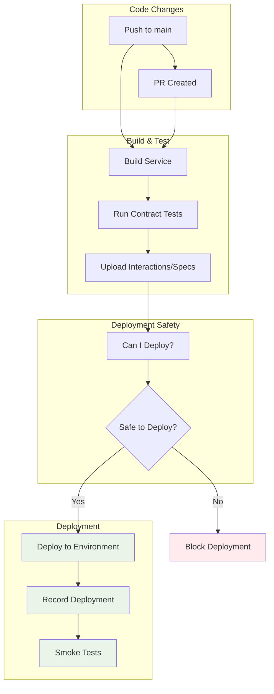

GitHub Actions integration ensures contract testing happens automatically as part of your CI/CD pipeline, catching integration issues before they reach production.

## Overview

Entente integrates into GitHub Actions workflows to provide automated contract testing at key points in your development lifecycle:



## Core CLI Commands

Entente provides several CLI commands for CI/CD integration:

### register-service
Register a service (consumer or provider) with Entente:

```bash
entente register-service \
  --type provider \
  --name castle-service \
  --spec spec/openapi.json \
  --spec-version 0.1.0 \
  --environment development
```

### can-i-deploy
Check if a service can safely deploy to an environment:

```bash
entente can-i-deploy \
  --type consumer \
  --service castle-client \
  --service-version 0.1.3 \
  --environment production
```

### deploy-service
Record a successful deployment:

```bash
entente deploy-service \
  --type provider \
  --name castle-service \
  --service-version 0.1.0 \
  --environment production
```

### upload-spec
Upload an OpenAPI specification:

```bash
entente upload-spec \
  --service castle-service \
  --service-version 0.1.0 \
  --environment staging \
  --spec spec/openapi.json
```

### fixtures approve
Approve fixture proposals from successful test runs:

```bash
entente fixtures approve \
  --approved-by john.doe \
  --test-run build-123
```

## Complete Workflow Examples

### Consumer Workflow (castle-client)

**Build & Test Workflow:**
```yaml
# .github/workflows/castle-client-build-test.yml
name: Castle Client - Build & Test

on:
  push:
    branches: [main]
    paths:
      - 'examples/castle-client/**'
  pull_request:
    branches: [main]
    paths:
      - 'examples/castle-client/**'

jobs:
  build-and-test:
    runs-on: ubuntu-latest

    steps:
      - name: Checkout
        uses: actions/checkout@v4

      - name: Setup Node.js
        uses: actions/setup-node@v4
        with:
          node-version: '20'

      - name: Setup pnpm
        uses: pnpm/action-setup@v4

      - name: Install dependencies
        working-directory: examples/castle-client
        run: |
          pnpm add @entente/types@latest @entente/consumer@latest @entente/fixtures@latest
          pnpm install

      - name: Install Entente CLI
        run: npm install -g @entente/cli@latest

      - name: Build
        env:
          ENTENTE_SERVICE_URL: ${{ vars.ENTENTE_SERVICE_URL }}
          ENTENTE_API_KEY: ${{ secrets.ENTENTE_API_KEY }}
        run: pnpm --filter @entente/example-castle-client build

      - name: Register consumer service
        env:
          ENTENTE_API_KEY: ${{ secrets.ENTENTE_API_KEY }}
        run: |
          cd examples/castle-client
          entente register-service \
            --type consumer \
            --name castle-client \
            --environment development

      - name: Run consumer contract tests
        env:
          ENTENTE_SERVICE_URL: ${{ vars.ENTENTE_SERVICE_URL }}
          ENTENTE_API_KEY: ${{ secrets.ENTENTE_API_KEY }}
        run: pnpm --filter @entente/example-castle-client test
```

**Deployment Workflow:**
```yaml
# .github/workflows/castle-client-deploy.yml
name: Castle Client - Deploy

on:
  workflow_run:
    workflows: ["Castle Client - Build & Test"]
    types: [completed]
    branches: [main]

jobs:
  deploy-development:
    if: github.event.workflow_run.conclusion == 'success'
    runs-on: ubuntu-latest
    environment: development

    steps:
      - name: Checkout
        uses: actions/checkout@v4

      - name: Setup environment
        uses: ./.github/actions/setup-node-pnpm

      - name: Install dependencies
        working-directory: examples/castle-client
        run: |
          pnpm add @entente/types@latest @entente/consumer@latest @entente/fixtures@latest
          pnpm install

      - name: Install Entente CLI
        run: npm install -g @entente/cli@latest

      - name: Build
        run: pnpm --filter @entente/example-castle-client build

      - name: Check deployment readiness
        env:
          ENTENTE_API_KEY: ${{ secrets.ENTENTE_API_KEY }}
        run: |
          cd examples/castle-client
          VERSION=$(node -p "require('./package.json').version")
          entente can-i-deploy \
            --type consumer \
            --service castle-client \
            --service-version $VERSION \
            --environment development

      - name: Deploy to Cloudflare Workers
        uses: cloudflare/wrangler-action@v3
        with:
          apiToken: ${{ secrets.CLOUDFLARE_API_TOKEN }}
          accountId: ${{ secrets.CLOUDFLARE_ACCOUNT_ID }}
          workingDirectory: examples/castle-client
          command: deploy --name castle-client-dev --env development

      - name: Record deployment
        env:
          ENTENTE_API_KEY: ${{ secrets.ENTENTE_API_KEY }}
        run: |
          cd examples/castle-client
          VERSION=$(node -p "require('./package.json').version")
          entente deploy-service \
            --name castle-client \
            --service-version $VERSION \
            --environment development \
            --type consumer

      - name: Run smoke tests
        run: |
          sleep 10
          curl -f https://castle-client-dev.example.workers.dev/health
```

### Provider Workflow (castle-service)

**Build & Test Workflow:**
```yaml
# .github/workflows/castle-service-build-test.yml
name: Castle Service - Build & Test

on:
  push:
    branches: [main]
    paths:
      - 'examples/castle-service/**'
  pull_request:
    branches: [main]
    paths:
      - 'examples/castle-service/**'

jobs:
  build-and-test:
    runs-on: ubuntu-latest

    steps:
      - name: Checkout
        uses: actions/checkout@v4

      - name: Setup Node.js
        uses: actions/setup-node@v4
        with:
          node-version: '20'

      - name: Setup pnpm
        uses: pnpm/action-setup@v4

      - name: Install dependencies
        working-directory: examples/castle-service
        run: |
          pnpm add @entente/types@latest @entente/provider@latest @entente/fixtures@latest
          pnpm install

      - name: Install Entente CLI
        run: npm install -g @entente/cli@latest

      - name: Build
        env:
          ENTENTE_SERVICE_URL: ${{ vars.ENTENTE_SERVICE_URL }}
          ENTENTE_API_KEY: ${{ secrets.ENTENTE_API_KEY }}
        run: pnpm --filter @entente/example-castle-service build

      - name: Register provider and upload spec
        env:
          ENTENTE_API_KEY: ${{ secrets.ENTENTE_API_KEY }}
        run: |
          cd examples/castle-service
          entente register-service \
            --type provider \
            --name castle-service \
            --spec spec/openapi.json \
            --spec-version 0.1.0 \
            --environment development

      - name: Run provider verification tests
        env:
          ENTENTE_SERVICE_URL: ${{ vars.ENTENTE_SERVICE_URL }}
          ENTENTE_API_KEY: ${{ secrets.ENTENTE_API_KEY }}
        run: pnpm --filter @entente/example-castle-service test
```

## Environment Configuration

### Required Secrets

Configure these secrets in your GitHub repository settings:

```bash
# Entente Authentication
ENTENTE_API_KEY=ent_your_api_key_here

# Deployment secrets (if using Cloudflare Workers)
CLOUDFLARE_API_TOKEN=your_cloudflare_token
CLOUDFLARE_ACCOUNT_ID=your_account_id
```

### Required Variables

Configure these variables in your GitHub repository settings:

```bash
# Entente Configuration (can be public)
ENTENTE_SERVICE_URL=https://entente.company.com

# Deployment configuration
CLOUDFLARE_WORKERS_SUBDOMAIN=your-workers-subdomain
```

### Environment-Specific Configuration

Use different environments for different deployment stages:

```yaml
jobs:
  deploy-development:
    environment: development
    steps:
      - name: Deploy to development
        env:
          ENVIRONMENT: development
        run: |
          entente can-i-deploy \
            --service castle-client \
            --environment development

  deploy-production:
    environment: production
    needs: [deploy-development]
    steps:
      - name: Deploy to production
        env:
          ENVIRONMENT: production
        run: |
          entente can-i-deploy \
            --service castle-client \
            --environment production
```

## Multi-Environment Deployment

Deploy through multiple environments with safety checks at each stage:

```yaml
jobs:
  deploy-development:
    runs-on: ubuntu-latest
    environment: development
    steps:
      - name: Deploy to development
        # ... deployment steps

  deploy-staging:
    needs: [deploy-development]
    if: needs.deploy-development.result == 'success'
    runs-on: ubuntu-latest
    environment: staging
    steps:
      - name: Check staging deployment safety
        run: |
          entente can-i-deploy \
            --service castle-service \
            --environment staging
      - name: Deploy to staging
        # ... deployment steps

  deploy-production:
    needs: [deploy-staging]
    if: needs.deploy-staging.result == 'success'
    runs-on: ubuntu-latest
    environment: production
    steps:
      - name: Check production deployment safety
        run: |
          entente can-i-deploy \
            --service castle-service \
            --environment production
      - name: Deploy to production
        # ... deployment steps
```

## Path-Based Triggering

Only run workflows when relevant files change:

```yaml
on:
  push:
    branches: [main]
    paths:
      - 'examples/castle-service/**'      # Service code
      - 'spec/**'                         # OpenAPI specs
      - '.github/workflows/castle-service-*.yml'  # Workflow files
  pull_request:
    branches: [main]
    paths:
      - 'examples/castle-service/**'
      - 'spec/**'
      - '.github/workflows/castle-service-*.yml'
```

## Manual Deployment Control

Allow manual deployments with environment selection:

```yaml
on:
  workflow_dispatch:
    inputs:
      environment:
        description: 'Environment to deploy to'
        required: true
        default: 'development'
        type: choice
        options:
          - development
          - staging
          - production
      service_version:
        description: 'Service version to deploy'
        required: false
        default: 'auto'

jobs:
  deploy:
    runs-on: ubuntu-latest
    environment: ${{ github.event.inputs.environment }}
    steps:
      - name: Get service version
        id: version
        run: |
          if [ "${{ github.event.inputs.service_version }}" = "auto" ]; then
            VERSION=$(node -p "require('./package.json').version")
          else
            VERSION="${{ github.event.inputs.service_version }}"
          fi
          echo "version=$VERSION" >> $GITHUB_OUTPUT

      - name: Check deployment safety
        run: |
          entente can-i-deploy \
            --service castle-service \
            --service-version ${{ steps.version.outputs.version }} \
            --environment ${{ github.event.inputs.environment }}
```

## Error Handling and Notifications

### Deployment Safety Failures

Handle can-i-deploy failures gracefully:

```yaml
- name: Check deployment readiness
  id: can-i-deploy
  continue-on-error: true
  env:
    ENTENTE_API_KEY: ${{ secrets.ENTENTE_API_KEY }}
  run: |
    cd examples/castle-service
    VERSION=$(node -p "require('./package.json').version")
    entente can-i-deploy \
      --type provider \
      --service castle-service \
      --service-version $VERSION \
      --environment production

- name: Handle deployment safety failure
  if: steps.can-i-deploy.outcome == 'failure'
  run: |
    echo "❌ Deployment safety check failed"
    echo "This version cannot be safely deployed to production"
    echo "Possible reasons:"
    echo "- Consumer services haven't verified against this version"
    echo "- Breaking changes detected in API contract"
    echo "- No consumers are currently deployed that can work with this version"
    echo ""
    echo "Next steps:"
    echo "1. Check consumer verification status"
    echo "2. Coordinate with consumer teams"
    echo "3. Consider feature flags or backward compatibility"
    exit 1
```

### Slack Notifications

Notify teams about deployment status:

```yaml
- name: Notify deployment success
  if: success()
  uses: 8398a7/action-slack@v3
  with:
    status: success
    channel: '#deployments'
    text: |
      ✅ ${{ github.repository }} deployed to ${{ github.event.inputs.environment }}
      Version: ${{ steps.version.outputs.version }}
      Commit: ${{ github.sha }}
  env:
    SLACK_WEBHOOK_URL: ${{ secrets.SLACK_WEBHOOK_URL }}

- name: Notify deployment failure
  if: failure()
  uses: 8398a7/action-slack@v3
  with:
    status: failure
    channel: '#deployments'
    text: |
      ❌ ${{ github.repository }} deployment to ${{ github.event.inputs.environment }} failed
      Version: ${{ steps.version.outputs.version }}
      Check: ${{ github.server_url }}/${{ github.repository }}/actions/runs/${{ github.run_id }}
  env:
    SLACK_WEBHOOK_URL: ${{ secrets.SLACK_WEBHOOK_URL }}
```

## Fixture Management in CI

### Automatic Fixture Approval

Approve fixtures from successful test runs:

```yaml
- name: Run consumer tests
  id: consumer-tests
  env:
    ENTENTE_SERVICE_URL: ${{ vars.ENTENTE_SERVICE_URL }}
    ENTENTE_API_KEY: ${{ secrets.ENTENTE_API_KEY }}
  run: |
    BUILD_ID="${{ github.run_id }}" pnpm test

- name: Approve fixtures from successful test run
  if: steps.consumer-tests.outcome == 'success'
  env:
    ENTENTE_API_KEY: ${{ secrets.ENTENTE_API_KEY }}
  run: |
    entente fixtures approve \
      --approved-by "github-actions[bot]" \
      --test-run "${{ github.run_id }}"
```

### Fixture Review Workflow

Create PRs for fixture changes that need human review:

```yaml
- name: Check for new fixtures
  id: fixtures
  run: |
    NEW_FIXTURES=$(entente fixtures list --service castle-service --status draft | wc -l)
    echo "count=$NEW_FIXTURES" >> $GITHUB_OUTPUT

- name: Create fixture review PR
  if: steps.fixtures.outputs.count > 0
  uses: peter-evans/create-pull-request@v5
  with:
    token: ${{ secrets.GITHUB_TOKEN }}
    commit-message: "Add new fixtures for castle-service"
    title: "Review new fixtures for castle-service"
    body: |
      ## New Fixtures for Review

      This PR contains ${{ steps.fixtures.outputs.count }} new fixtures that were generated
      during the test run.

      **Test Run:** ${{ github.run_id }}
      **Branch:** ${{ github.ref_name }}
      **Commit:** ${{ github.sha }}

      Please review the fixtures and approve them if they look correct:

      ```bash
      entente fixtures approve --approved-by "your-name" --test-run "${{ github.run_id }}"
      ```
    branch: fixtures/castle-service-${{ github.run_id }}
```

## Performance Optimization

### Dependency Caching

Cache dependencies between workflow runs:

```yaml
- name: Setup pnpm cache
  uses: actions/cache@v3
  with:
    path: ~/.pnpm-store
    key: ${{ runner.os }}-pnpm-${{ hashFiles('**/pnpm-lock.yaml') }}
    restore-keys: |
      ${{ runner.os }}-pnpm-

- name: Install dependencies
  run: pnpm install --frozen-lockfile
```

### Conditional Execution

Skip unnecessary work when possible:

```yaml
- name: Check for changes
  uses: dorny/paths-filter@v3
  id: changes
  with:
    filters: |
      service:
        - 'examples/castle-service/**'
      spec:
        - 'spec/**'
      workflows:
        - '.github/workflows/castle-service-*.yml'

- name: Run tests
  if: steps.changes.outputs.service == 'true'
  run: pnpm test

- name: Upload spec
  if: steps.changes.outputs.spec == 'true'
  run: entente upload-spec --spec spec/openapi.json
```

## Security Best Practices

### API Key Management

- Store `ENTENTE_API_KEY` as a repository secret
- Use environment-specific API keys when possible
- Rotate API keys regularly
- Limit API key permissions to minimum required

### Least Privilege Access

Limit GitHub Actions permissions:

```yaml
permissions:
  contents: read      # Read repository contents
  actions: read       # Read action results
  deployments: write  # Create deployments
  pull-requests: write # Create fixture review PRs (if needed)
```

### Environment Protection Rules

Configure environment protection rules in GitHub:

- **Development**: No restrictions
- **Staging**: Require pull request reviews
- **Production**: Require approval from specific teams

## Next Steps

- **[register-service](/github-actions/register-service/)** - Detailed guide to service registration
- **[can-i-deploy](/github-actions/can-i-deploy/)** - Understanding deployment safety checks
- **[deploy-service](/github-actions/deploy-service/)** - Recording deployments

GitHub Actions integration provides automated contract testing throughout your development lifecycle, ensuring integration issues are caught early and deployments are safe.