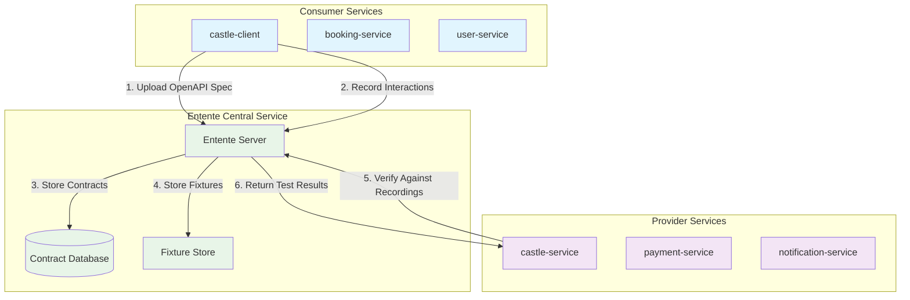

Entente is a **schema-first contract testing platform** that revolutionizes how teams build and maintain reliable APIs. By combining OpenAPI specifications with real interaction recording, Entente provides automated contract testing that prevents integration failures and enables confident deployments.

## What is Contract Testing?

Contract testing is a methodology that ensures the interfaces between services work correctly without requiring full end-to-end integration tests. Instead of testing entire systems together, contract testing focuses on the **specific interactions** between individual services.

In a microservices architecture, services communicate through APIs. Contract testing guarantees that:

- **Consumers** can successfully call the APIs they depend on
- **Providers** implement the APIs that consumers actually need
- **Changes** to APIs don't break existing consumer dependencies
- **Deployments** are safe when all contract tests pass

## Architecture Overview

Entente follows a hub-and-spoke model with a central service coordinating contract testing between consumers and providers:



## The Entente Workflow

### 1. **OpenAPI-First Development**
Every contract starts with an OpenAPI specification that defines the API interface:

```json
{
  "openapi": "3.0.3",
  "info": {
    "title": "Castle Service API",
    "version": "1.0.0"
  },
  "paths": {
    "/castles": {
      "get": {
        "operationId": "listCastles",
        "responses": {
          "200": {
            "description": "List of castles",
            "content": {
              "application/json": {
                "schema": {
                  "type": "array",
                  "items": { "$ref": "#/components/schemas/Castle" }
                }
              }
            }
          }
        }
      }
    }
  }
}
```

### 2. **Consumer Testing with Mock Servers**
Consumers create mock servers from OpenAPI specs and record their interactions:

```typescript
import { createClient } from '@entente/consumer'

const client = createClient({
  serviceUrl: 'https://entente.company.com',
  apiKey: process.env.ENTENTE_API_KEY,
  consumer: 'castle-client',
  environment: 'test',
  recordingEnabled: process.env.CI === 'true'
})

// Create mock server from provider's OpenAPI spec
const mock = await client.createMock('castle-service', '0.1.0', {
  useFixtures: true,
  validateRequests: true,
  validateResponses: true
})

// Use mock.url in your tests - interactions are recorded automatically
const castles = await fetch(`${mock.url}/castles`).then(r => r.json())
```

### 3. **Provider Verification**
Providers replay recorded consumer interactions against their real implementation:

```typescript
import { createProvider } from '@entente/provider'

const provider = createProvider({
  serviceUrl: 'https://entente.company.com',
  apiKey: process.env.ENTENTE_API_KEY,
  provider: 'castle-service'
})

const results = await provider.verify({
  baseUrl: 'http://localhost:4001', // Your running service
  environment: 'test',
  stateHandlers: {
    'listCastles': async () => {
      // Setup test data before verification
      await resetDatabase()
    }
  },
  cleanup: async () => {
    // Cleanup after each test
    await cleanupTestData()
  }
})
```

### 4. **Deployment Safety Checks**
Before deploying, check if your changes are compatible with existing consumers:

```bash
# Consumer checking if they can deploy
entente can-i-deploy \
  --type consumer \
  --service castle-client \
  --service-version 0.1.3 \
  --environment production

# Provider checking if they can deploy
entente can-i-deploy \
  --type provider \
  --service castle-service \
  --service-version 0.2.0 \
  --environment production
```

## Why Entente?

### Problems with Traditional Testing

Traditional integration testing approaches have critical limitations:

- **Slow & Flaky Integration Tests** - Require all services running, prone to environmental issues
- **Mock Drift** - Hand-written mocks become outdated and miss real integration problems
- **Manual Coordination** - Teams must manually coordinate API changes across services
- **Late Feedback** - Integration issues discovered only during full system testing
- **Deployment Fear** - Uncertainty about whether changes will break dependent services

### The Entente Solution

Entente addresses these problems through:

**🎯 OpenAPI-First Contracts**
- All APIs start with machine-readable OpenAPI specifications
- Specifications serve as both documentation and test contracts
- Automated mock server generation ensures mocks never drift from specs

**📊 Real Interaction Recording**
- Consumer tests automatically record actual API interactions in CI
- Recordings capture real usage patterns, not theoretical scenarios
- No manual work required - happens automatically during existing tests

**🔄 Automated Provider Verification**
- Providers replay recorded consumer interactions against real implementations
- Verification runs against actual service code, not mocks
- Catches integration issues before deployment

**🚀 Deployment Safety**
- "Can I Deploy" checks prevent breaking changes from reaching production
- Automated compatibility verification across all consumer-provider pairs
- Deploy with confidence knowing all contracts are satisfied

## Key Concepts

### Smart Fixture Management

Entente's fixture system provides deterministic testing with real data:

- **Auto-Generation**: Fixtures are automatically collected during successful test runs
- **Approval Workflow**: Teams review and approve new fixtures before they're used
- **Priority System**: Provider fixtures (from real responses) take priority over consumer fixtures
- **Realistic Data**: Based on actual API responses, not synthetic test data

### Deployment Awareness

Unlike traditional contract testing tools, Entente tracks which service versions are actually deployed:

- Only test against actively deployed provider versions
- Avoid false positives from testing against undeployed code
- Deployment history provides rollback guidance

### Environment Isolation

Contracts are managed per environment:

- Development contracts for rapid iteration
- Staging contracts for integration validation
- Production contracts for deployment safety
- Environment-specific fixture sets

## Real-World Example

Here's how the castle-service and castle-client demonstrate Entente in practice:

**Provider (castle-service)**:
- Defines OpenAPI spec for castle management API
- Runs verification tests against recorded consumer interactions
- Uses state handlers to setup test data before each verification

**Consumer (castle-client)**:
- Creates mock castle-service from OpenAPI spec
- Tests against deterministic fixtures
- Records interactions automatically in CI

**CI/CD Integration**:
- Both services check `can-i-deploy` before deployment
- Automatic registration and deployment recording
- Fixture approval workflow integrated into development process

## Benefits

### For Development Teams

- **🚀 Faster Feedback** - Catch integration issues during unit test execution
- **😌 Confident Deployments** - Know your changes won't break consumers before you deploy
- **🤝 Better Collaboration** - Clear, machine-readable contracts between teams
- **⚡ Parallel Development** - Teams can develop against contracts without waiting for implementations

### For Organizations

- **🛡️ Improved Reliability** - Prevent integration failures from reaching production
- **📈 Faster Delivery** - Reduce coordination overhead between teams
- **📚 Living Documentation** - OpenAPI specs stay current with actual implementations
- **💰 Reduced Costs** - Fewer production incidents and faster resolution of integration issues

## Getting Started

Ready to implement contract testing with Entente? Here's your path forward:

1. **[For Providers](/providers/)** - Learn how to manage OpenAPI specs and verify against consumer interactions
2. **[For Consumers](/consumers/)** - Learn how to create mocks, manage fixtures, and record interactions
3. **[GitHub Actions](/github-actions/)** - Integrate Entente into your CI/CD pipelines
4. **[Fixtures](/fixtures/)** - Understand the fixture approval workflow and why it's essential

Start with our working example projects:
- [castle-service](https://github.com/entente-dev/entente/tree/main/examples/castle-service) - Example provider
- [castle-client](https://github.com/entente-dev/entente/tree/main/examples/castle-client) - Example consumer
