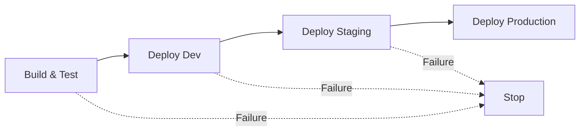

Integrating Entente provider testing into GitHub Actions ensures your API implementations are verified against real consumer interactions before deployment.

## Complete Provider Workflow

Here's the complete GitHub Actions setup from the castle-service example, covering build, test, and deployment:

### Build & Test Workflow

```yaml
# .github/workflows/castle-service-build-test.yml
name: Castle Service - Build & Test

on:
  push:
    branches: [main]
    paths:
      - 'examples/castle-service/**'
      - '.github/workflows/castle-service-build-test.yml'
  pull_request:
    branches: [main]
    paths:
      - 'examples/castle-service/**'
      - '.github/workflows/castle-service-build-test.yml'
  workflow_dispatch:

jobs:
  build-and-test:
    runs-on: ubuntu-latest

    steps:
      - name: Checkout
        uses: actions/checkout@v4

      - name: Setup Node.js
        uses: actions/setup-node@v4
        with:
          node-version: '20'

      - name: Setup pnpm
        uses: pnpm/action-setup@v4

      # Install published Entente packages (not local workspace packages)
      - name: Install published Entente packages
        working-directory: examples/castle-service
        run: pnpm add @entente/types@latest @entente/provider@latest @entente/fixtures@latest

      - name: Install dependencies
        working-directory: examples/castle-service
        run: pnpm install

      - name: Install Entente CLI globally
        run: npm install -g @entente/cli@latest

      - name: Build castle-service
        env:
          ENTENTE_SERVICE_URL: ${{ vars.ENTENTE_SERVICE_URL }}
          ENTENTE_API_KEY: ${{ secrets.ENTENTE_API_KEY }}
        run: pnpm --filter @entente/example-castle-service build

      # Register service with Entente (idempotent operation)
      - name: Register service with Entente
        env:
          ENTENTE_API_KEY: ${{ secrets.ENTENTE_API_KEY }}
        run: |
          cd examples/castle-service
          entente register-service \
            --type provider \
            --name castle-service \
            --spec spec/openapi.json \
            --spec-version 0.1.0 \
            --environment development

      # Run provider verification tests
      - name: Run provider verification tests
        env:
          ENTENTE_SERVICE_URL: ${{ vars.ENTENTE_SERVICE_URL }}
          ENTENTE_API_KEY: ${{ secrets.ENTENTE_API_KEY }}
        run: pnpm --filter @entente/example-castle-service test
```

### Deployment Workflow

```yaml
# .github/workflows/castle-service-deploy.yml
name: Castle Service - Deploy

on:
  workflow_run:
    workflows: ["Castle Service - Build & Test"]
    types:
      - completed
    branches: [main]
  workflow_dispatch:
    inputs:
      environment:
        description: 'Environment to deploy to'
        required: true
        default: 'development'
        type: choice
        options:
          - development
          - staging
          - production

jobs:
  deploy-development:
    if: (github.event_name == 'workflow_run' && github.event.workflow_run.conclusion == 'success') || (github.event_name == 'workflow_dispatch')
    runs-on: ubuntu-latest
    environment: development

    steps:
      - name: Checkout
        uses: actions/checkout@v4

      - name: Setup Node.js
        uses: actions/setup-node@v4
        with:
          node-version: '20'

      - name: Setup pnpm
        uses: pnpm/action-setup@v4

      - name: Install published Entente packages
        working-directory: examples/castle-service
        run: pnpm add @entente/types@latest @entente/provider@latest @entente/fixtures@latest

      - name: Install dependencies
        working-directory: examples/castle-service
        run: pnpm install

      - name: Install Entente CLI globally
        run: npm install -g @entente/cli@latest

      - name: Build castle-service
        env:
          ENTENTE_SERVICE_URL: ${{ vars.ENTENTE_SERVICE_URL }}
          ENTENTE_API_KEY: ${{ secrets.ENTENTE_API_KEY }}
        run: pnpm --filter @entente/example-castle-service build

      # Upload OpenAPI spec for this version
      - name: Upload OpenAPI spec
        env:
          ENTENTE_API_KEY: ${{ secrets.ENTENTE_API_KEY }}
        run: |
          cd examples/castle-service
          VERSION=$(node -p "require('./package.json').version")
          entente upload-spec \
            --service castle-service \
            --service-version $VERSION \
            --environment development \
            --spec spec/openapi.json

      # Check if it's safe to deploy
      - name: Check deployment readiness
        env:
          ENTENTE_API_KEY: ${{ secrets.ENTENTE_API_KEY }}
        run: |
          cd examples/castle-service
          VERSION=$(node -p "require('./package.json').version")
          entente can-i-deploy \
            --type provider \
            --service castle-service \
            --service-version $VERSION \
            --environment development

      # Deploy to Cloudflare Workers
      - name: Deploy to Cloudflare Workers (Development)
        uses: cloudflare/wrangler-action@v3
        with:
          apiToken: ${{ secrets.CLOUDFLARE_API_TOKEN }}
          accountId: ${{ secrets.CLOUDFLARE_ACCOUNT_ID }}
          workingDirectory: examples/castle-service
          command: deploy --name castle-service-dev --env development
        env:
          ENVIRONMENT: development

      # Record the deployment in Entente
      - name: Record deployment
        env:
          ENTENTE_API_KEY: ${{ secrets.ENTENTE_API_KEY }}
        run: |
          cd examples/castle-service
          VERSION=$(node -p "require('./package.json').version")
          entente deploy-service \
            --name castle-service \
            --service-version $VERSION \
            --environment development \
            --type provider

      # Run smoke tests
      - name: Run smoke tests
        run: |
          sleep 10
          curl -f https://castle-service-dev.${{ vars.CLOUDFLARE_WORKERS_SUBDOMAIN }}.workers.dev/health || exit 1

  deploy-staging:
    if: needs.deploy-development.result == 'success'
    needs: [deploy-development]
    runs-on: ubuntu-latest
    environment: staging

    steps:
      # ... similar steps for staging environment
      - name: Check deployment readiness
        env:
          ENTENTE_API_KEY: ${{ secrets.ENTENTE_API_KEY }}
        run: |
          cd examples/castle-service
          VERSION=$(node -p "require('./package.json').version")
          entente can-i-deploy \
            --type provider \
            --service castle-service \
            --service-version $VERSION \
            --environment staging

  deploy-production:
    if: needs.deploy-staging.result == 'success'
    needs: [deploy-staging]
    runs-on: ubuntu-latest
    environment: production

    steps:
      # ... similar steps for production environment
      - name: Check deployment readiness
        env:
          ENTENTE_API_KEY: ${{ secrets.ENTENTE_API_KEY }}
        run: |
          cd examples/castle-service
          VERSION=$(node -p "require('./package.json').version")
          entente can-i-deploy \
            --type provider \
            --service castle-service \
            --service-version $VERSION \
            --environment production
```

## Key Integration Points

### 1. Service Registration

Register your provider service and upload the OpenAPI spec:

```yaml
- name: Register service with Entente
  env:
    ENTENTE_API_KEY: ${{ secrets.ENTENTE_API_KEY }}
  run: |
    cd examples/castle-service
    entente register-service \
      --type provider \
      --name castle-service \
      --spec spec/openapi.json \
      --spec-version 0.1.0 \
      --environment development
```

### 2. Provider Verification

Run provider tests that verify against recorded consumer interactions:

```yaml
- name: Run provider verification tests
  env:
    ENTENTE_SERVICE_URL: ${{ vars.ENTENTE_SERVICE_URL }}
    ENTENTE_API_KEY: ${{ secrets.ENTENTE_API_KEY }}
  run: pnpm --filter @entente/example-castle-service test
```

### 3. Spec Upload

Upload your OpenAPI spec for the specific version being deployed:

```yaml
- name: Upload OpenAPI spec
  env:
    ENTENTE_API_KEY: ${{ secrets.ENTENTE_API_KEY }}
  run: |
    cd examples/castle-service
    VERSION=$(node -p "require('./package.json').version")
    entente upload-spec \
      --service castle-service \
      --service-version $VERSION \
      --environment development \
      --spec spec/openapi.json
```

### 4. Deployment Safety Check

Verify it's safe to deploy before actually deploying:

```yaml
- name: Check deployment readiness
  env:
    ENTENTE_API_KEY: ${{ secrets.ENTENTE_API_KEY }}
  run: |
    cd examples/castle-service
    VERSION=$(node -p "require('./package.json').version")
    entente can-i-deploy \
      --type provider \
      --service castle-service \
      --service-version $VERSION \
      --environment development
```

### 5. Deployment Recording

Record the successful deployment in Entente:

```yaml
- name: Record deployment
  env:
    ENTENTE_API_KEY: ${{ secrets.ENTENTE_API_KEY }}
  run: |
    cd examples/castle-service
    VERSION=$(node -p "require('./package.json').version")
    entente deploy-service \
      --name castle-service \
      --service-version $VERSION \
      --environment development \
      --type provider
```

## Environment Variables & Secrets

### Required Secrets

Configure these secrets in your GitHub repository:

```bash
# Entente API key for authentication
ENTENTE_API_KEY=ent_your_api_key_here

# If deploying to Cloudflare Workers
CLOUDFLARE_API_TOKEN=your_cloudflare_token
CLOUDFLARE_ACCOUNT_ID=your_account_id
```

### Required Variables

Configure these variables in your GitHub repository:

```bash
# Entente server URL (can be public)
ENTENTE_SERVICE_URL=https://entente.company.com

# If using Cloudflare Workers
CLOUDFLARE_WORKERS_SUBDOMAIN=your-workers-subdomain
```

## Path-Based Triggering

Only run workflows when relevant files change:

```yaml
on:
  push:
    branches: [main]
    paths:
      - 'examples/castle-service/**'      # Service code
      - '.github/workflows/castle-service-*.yml'  # Workflow files
  pull_request:
    branches: [main]
    paths:
      - 'examples/castle-service/**'
      - '.github/workflows/castle-service-*.yml'
```

## Multi-Environment Deployment

Deploy to multiple environments in sequence:



Each environment has its own safety checks:

```yaml
# Development: More permissive
- name: Check deployment readiness (dev)
  run: |
    entente can-i-deploy \
      --type provider \
      --service castle-service \
      --service-version $VERSION \
      --environment development

# Production: Strict requirements
- name: Check deployment readiness (prod)
  run: |
    entente can-i-deploy \
      --type provider \
      --service castle-service \
      --service-version $VERSION \
      --environment production
```

## Manual Deployment Control

Allow manual deployments with environment selection:

```yaml
on:
  workflow_dispatch:
    inputs:
      environment:
        description: 'Environment to deploy to'
        required: true
        default: 'development'
        type: choice
        options:
          - development
          - staging
          - production
```

## Error Handling

### Deployment Safety Failures

When `can-i-deploy` fails, the workflow stops:

```yaml
- name: Check deployment readiness
  id: can-i-deploy
  env:
    ENTENTE_API_KEY: ${{ secrets.ENTENTE_API_KEY }}
  run: |
    cd examples/castle-service
    VERSION=$(node -p "require('./package.json').version")
    if ! entente can-i-deploy \
      --type provider \
      --service castle-service \
      --service-version $VERSION \
      --environment development; then
      echo "❌ Deployment safety check failed"
      echo "This version cannot be safely deployed to development"
      echo "Check consumer compatibility before proceeding"
      exit 1
    fi
```

### Provider Test Failures

When provider verification fails:

```yaml
- name: Run provider verification tests
  env:
    ENTENTE_SERVICE_URL: ${{ vars.ENTENTE_SERVICE_URL }}
    ENTENTE_API_KEY: ${{ secrets.ENTENTE_API_KEY }}
  run: |
    if ! pnpm --filter @entente/example-castle-service test; then
      echo "❌ Provider verification failed"
      echo "Your implementation doesn't match recorded consumer expectations"
      echo "Check the test output for details on what failed"
      exit 1
    fi
```

## Package.json Scripts

Add convenient scripts for local development:

```json
{
  "scripts": {
    "test": "vitest run test/provider.test.ts",
    "register:provider": "entente register-service --type provider --name castle-service --spec spec/openapi.json --spec-version 0.1.0 --environment test",
    "upload:spec": "entente upload-spec --service castle-service --service-version 0.1.0 --environment test --spec spec/openapi.json",
    "can-i-deploy": "entente can-i-deploy --type provider --service castle-service --service-version 0.1.0 --environment test",
    "deploy:provider": "entente deploy-service --type provider --name castle-service --service-version 0.1.0 --environment test"
  }
}
```

## Performance Optimization

### Dependency Caching

Cache dependencies between workflow runs:

```yaml
- name: Setup pnpm
  uses: pnpm/action-setup@v4
  with:
    run_install: false

- name: Get pnpm store directory
  shell: bash
  run: |
    echo "STORE_PATH=$(pnpm store path --silent)" >> $GITHUB_ENV

- name: Setup pnpm cache
  uses: actions/cache@v3
  with:
    path: ${{ env.STORE_PATH }}
    key: ${{ runner.os }}-pnpm-store-${{ hashFiles('**/pnpm-lock.yaml') }}
    restore-keys: |
      ${{ runner.os }}-pnpm-store-
```

### Conditional Steps

Skip unnecessary work when possible:

```yaml
- name: Check if provider files changed
  uses: dorny/paths-filter@v3
  id: changes
  with:
    filters: |
      provider:
        - 'examples/castle-service/**'

- name: Run provider tests
  if: steps.changes.outputs.provider == 'true'
  run: pnpm test
```

## Monitoring & Notifications

### Deployment Notifications

Notify teams about deployment status:

```yaml
- name: Notify deployment success
  if: success()
  run: |
    curl -X POST ${{ secrets.SLACK_WEBHOOK_URL }} \
      -H 'Content-type: application/json' \
      --data '{"text":"✅ castle-service deployed to development successfully"}'

- name: Notify deployment failure
  if: failure()
  run: |
    curl -X POST ${{ secrets.SLACK_WEBHOOK_URL }} \
      -H 'Content-type: application/json' \
      --data '{"text":"❌ castle-service deployment to development failed"}'
```

### Contract Test Reports

Generate test reports for visibility:

```yaml
- name: Generate verification report
  if: always()
  run: |
    echo "## Provider Verification Report" >> $GITHUB_STEP_SUMMARY
    echo "Service: castle-service" >> $GITHUB_STEP_SUMMARY
    echo "Version: $(node -p 'require(\"./package.json\").version')" >> $GITHUB_STEP_SUMMARY
    echo "Environment: development" >> $GITHUB_STEP_SUMMARY
```

## Security Best Practices

### API Key Management

- Store `ENTENTE_API_KEY` as a repository secret
- Use environment-specific API keys when possible
- Rotate API keys regularly

### Least Privilege Access

- Limit GitHub Actions permissions:

```yaml
permissions:
  contents: read
  deployments: write
  actions: read
```

## Next Steps

- **[State Management](/providers/state-management/)** - Advanced patterns for test data management
- **[Troubleshooting](/providers/troubleshooting/)** - Common CI/CD issues and solutions
- **[Monitoring](/providers/monitoring/)** - Track provider verification health over time

The GitHub Actions integration ensures your provider implementations are thoroughly tested against real consumer usage before reaching production, giving you confidence in every deployment.