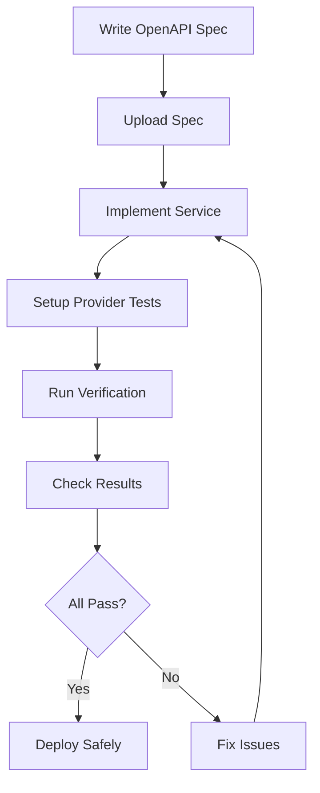

As a **provider**, you implement APIs that consumers depend on. Entente helps you ensure your implementations match what consumers actually need by verifying your service against real recorded consumer interactions.

## Overview

Provider testing in Entente follows this workflow:



## Quick Start for Providers

Here's how to get started as a provider using our castle-service example:

### 1. Install Dependencies

```bash
npm install @entente/provider @entente/types
# Install CLI globally for deployment commands
npm install -g @entente/cli
```

### 2. Create Provider Test

```typescript
// test/provider.test.ts
import { createProvider } from '@entente/provider'
import { serve } from '@hono/node-server'
import { beforeEach, afterEach, describe, it, expect } from 'vitest'
import app from '../src/index.js'
import { resetCastles } from '../src/db.js'

describe('Castle Service Provider Verification', () => {
  let server: ReturnType<typeof serve>
  const testPort = 4001

  beforeEach(async () => {
    // Reset test data
    resetCastles()

    // Start your service
    server = serve({
      fetch: app.fetch,
      port: testPort,
    })

    await new Promise(resolve => setTimeout(resolve, 100))
  })

  afterEach(async () => {
    if (server) {
      server.close()
      await new Promise(resolve => setTimeout(resolve, 100))
    }
  })

  it('should verify against recorded consumer interactions', async () => {
    const provider = createProvider({
      serviceUrl: process.env.ENTENTE_SERVICE_URL,
      apiKey: process.env.ENTENTE_API_KEY,
      provider: 'castle-service',
    })

    const results = await provider.verify({
      baseUrl: `http://localhost:${testPort}`,
      environment: 'test',
      stateHandlers: {
        listCastles: async () => {
          resetCastles() // Setup clean state
        },
        getCastle: async () => {
          resetCastles()
        },
        createCastle: async () => {
          resetCastles()
        },
        deleteCastle: async () => {
          resetCastles()
        },
      },
      cleanup: async () => {
        resetCastles() // Cleanup after each verification
      },
    })

    // All verifications should pass
    const failedResults = results.results.filter(r => !r.success)
    expect(failedResults.length).toBe(0)
  })
})
```

### 3. Run Verification

```bash
# Run your provider tests
npm test

# Check deployment safety
entente can-i-deploy \
  --type provider \
  --service castle-service \
  --service-version 0.1.0 \
  --environment production
```

## Core Concepts

### State Handlers

State handlers prepare your service for each verification by setting up the required test data:

```typescript
const results = await provider.verify({
  baseUrl: 'http://localhost:4001',
  environment: 'test',
  stateHandlers: {
    // Handler for listCastles operation
    'listCastles': async () => {
      // Setup: Ensure database has expected castles
      await db.insertCastles([
        { id: '1', name: 'Versailles', region: 'Île-de-France' },
        { id: '2', name: 'Fontainebleau', region: 'Île-de-France' }
      ])
    },

    // Handler for getCastle operation
    'getCastle': async () => {
      // Setup: Ensure specific castle exists
      await db.insertCastle({
        id: '550e8400-e29b-41d4-a716-446655440000',
        name: 'Versailles'
      })
    },

    // Handler for createCastle operation
    'createCastle': async () => {
      // Setup: Clean database for creation test
      await db.clearCastles()
    }
  }
})
```

### Response Validation

Entente validates that your provider responses match the structure expected by consumers:

- **Status codes** must match exactly
- **Response structure** must contain all fields consumers expect
- **Field types** must match (but values can differ)
- **Extra fields** are allowed (additive changes are safe)

### Error Handling

When verification fails, Entente provides detailed information:

```typescript
const results = await provider.verify(options)

const failedResults = results.results.filter(r => !r.success)
if (failedResults.length > 0) {
  console.log('Failed verifications:')
  for (const result of failedResults) {
    console.log(`- ${result.interactionId}: ${result.error}`)
    if (result.errorDetails) {
      console.log(`  Expected: ${JSON.stringify(result.errorDetails.expected)}`)
      console.log(`  Actual: ${JSON.stringify(result.errorDetails.actual)}`)
    }
  }
}
```

## What's Next?

- **[Managing OpenAPI Specs](/providers/openapi-specs/)** - Learn how to create and upload OpenAPI specifications
- **[Provider Verification](/providers/verification/)** - Deep dive into the verification process
- **[GitHub Actions](/providers/github-actions/)** - Integrate provider testing into your CI/CD pipeline
- **[State Management](/providers/state-management/)** - Advanced patterns for managing test state

## Example Project

The [castle-service](https://github.com/entente-dev/entente/tree/main/examples/castle-service) provides a complete working example of provider testing with:

- OpenAPI specification
- Provider verification tests
- State handlers for different operations
- GitHub Actions CI/CD integration
- Deployment safety checks

Study this example to understand how all the pieces fit together in a real project.