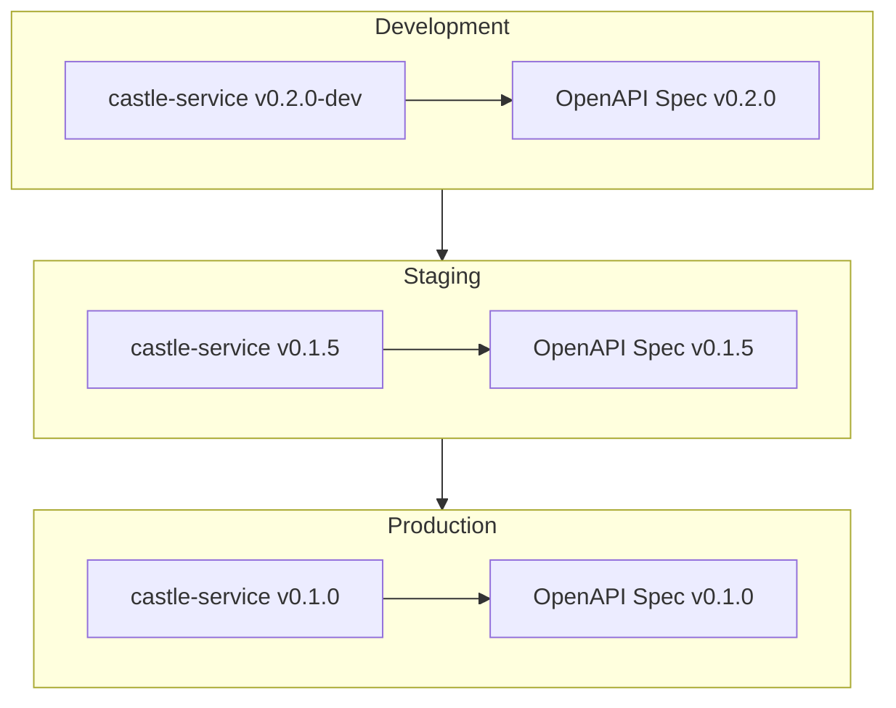

OpenAPI specifications are the foundation of contract testing in Entente. As a provider, your OpenAPI spec defines the contract that consumers will test against and that you'll verify your implementation matches.

## Creating OpenAPI Specifications

### Basic Structure

Here's the castle-service OpenAPI specification as a real example:

```json
{
  "openapi": "3.0.3",
  "info": {
    "title": "Castle Service API",
    "version": "1.0.0",
    "description": "A simple API for managing French castles"
  },
  "servers": [
    {
      "url": "http://localhost:4001",
      "description": "Development server"
    }
  ],
  "paths": {
    "/castles": {
      "get": {
        "operationId": "listCastles",
        "summary": "List all castles",
        "responses": {
          "200": {
            "description": "List of castles",
            "content": {
              "application/json": {
                "schema": {
                  "type": "array",
                  "items": {
                    "$ref": "#/components/schemas/Castle"
                  }
                },
                "example": [
                  {
                    "id": "550e8400-e29b-41d4-a716-446655440000",
                    "name": "Château de Versailles",
                    "region": "Île-de-France",
                    "yearBuilt": 1623
                  }
                ]
              }
            }
          }
        }
      },
      "post": {
        "operationId": "createCastle",
        "summary": "Create a new castle",
        "requestBody": {
          "required": true,
          "content": {
            "application/json": {
              "schema": {
                "$ref": "#/components/schemas/CreateCastleRequest"
              }
            }
          }
        },
        "responses": {
          "201": {
            "description": "Castle created successfully",
            "content": {
              "application/json": {
                "schema": {
                  "$ref": "#/components/schemas/Castle"
                }
              }
            }
          },
          "400": {
            "description": "Invalid input",
            "content": {
              "application/json": {
                "schema": {
                  "$ref": "#/components/schemas/Error"
                }
              }
            }
          }
        }
      }
    },
    "/castles/{id}": {
      "get": {
        "operationId": "getCastle",
        "summary": "Get a castle by ID",
        "parameters": [
          {
            "name": "id",
            "in": "path",
            "required": true,
            "schema": {
              "type": "string"
            }
          }
        ],
        "responses": {
          "200": {
            "description": "Castle details",
            "content": {
              "application/json": {
                "schema": {
                  "$ref": "#/components/schemas/Castle"
                }
              }
            }
          },
          "404": {
            "description": "Castle not found",
            "content": {
              "application/json": {
                "schema": {
                  "$ref": "#/components/schemas/Error"
                }
              }
            }
          }
        }
      },
      "delete": {
        "operationId": "deleteCastle",
        "summary": "Delete a castle",
        "parameters": [
          {
            "name": "id",
            "in": "path",
            "required": true,
            "schema": {
              "type": "string"
            }
          }
        ],
        "responses": {
          "204": {
            "description": "Castle deleted successfully"
          },
          "404": {
            "description": "Castle not found",
            "content": {
              "application/json": {
                "schema": {
                  "$ref": "#/components/schemas/Error"
                }
              }
            }
          }
        }
      }
    }
  },
  "components": {
    "schemas": {
      "Castle": {
        "type": "object",
        "required": ["id", "name", "region", "yearBuilt"],
        "properties": {
          "id": {
            "type": "string",
            "description": "Unique identifier for the castle"
          },
          "name": {
            "type": "string",
            "description": "Name of the castle"
          },
          "region": {
            "type": "string",
            "description": "French region where the castle is located"
          },
          "yearBuilt": {
            "type": "integer",
            "minimum": 1000,
            "maximum": 2100,
            "description": "Year the castle was built"
          },
          "description": {
            "type": "string",
            "description": "Optional description of the castle"
          }
        }
      },
      "CreateCastleRequest": {
        "type": "object",
        "required": ["name", "region", "yearBuilt"],
        "properties": {
          "name": {
            "type": "string",
            "minLength": 1,
            "description": "Name of the castle"
          },
          "region": {
            "type": "string",
            "minLength": 1,
            "description": "French region where the castle is located"
          },
          "yearBuilt": {
            "type": "integer",
            "minimum": 1000,
            "maximum": 2100,
            "description": "Year the castle was built"
          },
          "description": {
            "type": "string",
            "description": "Optional description of the castle"
          }
        }
      },
      "Error": {
        "type": "object",
        "required": ["error", "message"],
        "properties": {
          "error": {
            "type": "string",
            "description": "Error code"
          },
          "message": {
            "type": "string",
            "description": "Human-readable error message"
          }
        }
      }
    }
  }
}
```

### Best Practices for OpenAPI Specs

**1. Use Meaningful Operation IDs**
```json
{
  "get": {
    "operationId": "listCastles",  // ✅ Clear, descriptive
    "summary": "List all castles"
  }
}
```

**2. Include Realistic Examples**
```json
{
  "content": {
    "application/json": {
      "schema": { "$ref": "#/components/schemas/Castle" },
      "example": {
        "id": "550e8400-e29b-41d4-a716-446655440000",
        "name": "Château de Versailles",
        "region": "Île-de-France",
        "yearBuilt": 1623
      }
    }
  }
}
```

**3. Define All Response Codes**
```json
{
  "responses": {
    "200": { "description": "Success" },
    "400": { "description": "Bad request" },
    "404": { "description": "Not found" },
    "500": { "description": "Server error" }
  }
}
```

**4. Use Detailed Schema Validation**
```json
{
  "yearBuilt": {
    "type": "integer",
    "minimum": 1000,
    "maximum": 2100,
    "description": "Year the castle was built"
  }
}
```

## Uploading Specifications

### Using the CLI

Upload your OpenAPI spec to Entente using the CLI:

```bash
# Upload spec for development environment
entente upload-spec \
  --service castle-service \
  --service-version 0.1.0 \
  --environment development \
  --spec ./spec/openapi.json \
  --branch main

# Upload for staging environment
entente upload-spec \
  --service castle-service \
  --service-version 0.1.0 \
  --environment staging \
  --spec ./spec/openapi.json \
  --branch main
```

### During Service Registration

You can upload specs when registering your service:

```bash
entente register-service \
  --type provider \
  --name castle-service \
  --spec ./spec/openapi.json \
  --spec-version 0.1.0 \
  --environment development
```

### Package.json Scripts

Add convenient scripts to your package.json:

```json
{
  "scripts": {
    "upload:spec": "entente upload-spec --service castle-service --service-version 0.1.0 --environment test --spec spec/openapi.json",
    "register:provider": "entente register-service --type provider --name castle-service --spec spec/openapi.json --spec-version 0.1.0 --environment test"
  }
}
```

## Spec Versioning

### Environment-Based Versioning

Entente manages specs per environment, allowing different versions in each environment:



### Version Compatibility

When consumers request a provider spec, Entente:

1. **Checks for exact version match** in the requested environment
2. **Falls back to latest version** if exact match not found
3. **Warns** if using a different version than requested
4. **Fails** if no compatible version exists

Example consumer request:
```typescript
// Consumer requests castle-service v0.1.0
const mock = await client.createMock('castle-service', '0.1.0')

// Entente may use v0.1.5 if v0.1.0 not deployed
// and will log: "Using latest provider version: 0.1.5 for castle-service"
```

## Integration with Development

### Local Development

Keep your spec file alongside your code:

```
castle-service/
├── src/
│   └── index.ts
├── spec/
│   └── openapi.json    # Your OpenAPI spec
├── test/
│   └── provider.test.ts
└── package.json
```

### Auto-Upload in CI

Automatically upload specs during CI/CD:

```yaml
# .github/workflows/castle-service-build-test.yml
- name: Upload OpenAPI Spec
  env:
    ENTENTE_API_KEY: ${{ secrets.ENTENTE_API_KEY }}
  run: |
    entente upload-spec \
      --service castle-service \
      --service-version $(node -p "require('./package.json').version") \
      --environment development \
      --spec spec/openapi.json
```

### Swagger UI Integration

You can serve your OpenAPI spec locally for development:

```typescript
// src/index.ts
import { swaggerUI } from '@hono/swagger-ui'
import { readFileSync } from 'fs'

const app = new Hono()

// Serve Swagger UI
app.get('/docs', swaggerUI({
  url: '/spec'
}))

// Serve OpenAPI spec
app.get('/spec', (c) => {
  const spec = JSON.parse(readFileSync('./spec/openapi.json', 'utf-8'))
  return c.json(spec)
})
```

## Spec Validation

### Local Validation

Validate your spec before uploading:

```bash
# Using Swagger CLI
npx @apidevtools/swagger-cli validate spec/openapi.json

# Using Redoc CLI
npx redoc-cli validate spec/openapi.json
```

### Entente Validation

Entente validates specs during upload:

- **Schema compliance** with OpenAPI 3.0.3
- **Reference resolution** (all $ref links work)
- **Example validation** (examples match schemas)
- **Operation ID uniqueness**

## Common Pitfalls

### Missing Operation IDs
```json
{
  "get": {
    "operationId": "listCastles",  // ✅ Always include this
    "summary": "List all castles"
  }
}
```

### Inconsistent Examples
```json
{
  "schema": {
    "type": "object",
    "properties": {
      "yearBuilt": { "type": "integer" }
    }
  },
  "example": {
    "yearBuilt": "1623"  // ❌ String instead of integer
  }
}
```

### Missing Error Responses
```json
{
  "responses": {
    "200": { "description": "Success" },
    "404": { "description": "Not found" },  // ✅ Include error cases
    "400": { "description": "Bad request" }
  }
}
```

## Next Steps

- **[Provider Verification](/providers/verification/)** - Learn how to verify your implementation against the spec
- **[GitHub Actions](/providers/github-actions/)** - Automate spec uploads in CI/CD
- **[State Management](/providers/state-management/)** - Handle test data setup for verification

The OpenAPI specification is the foundation of everything else in Entente, so invest time in creating comprehensive, accurate specs that truly represent your API.