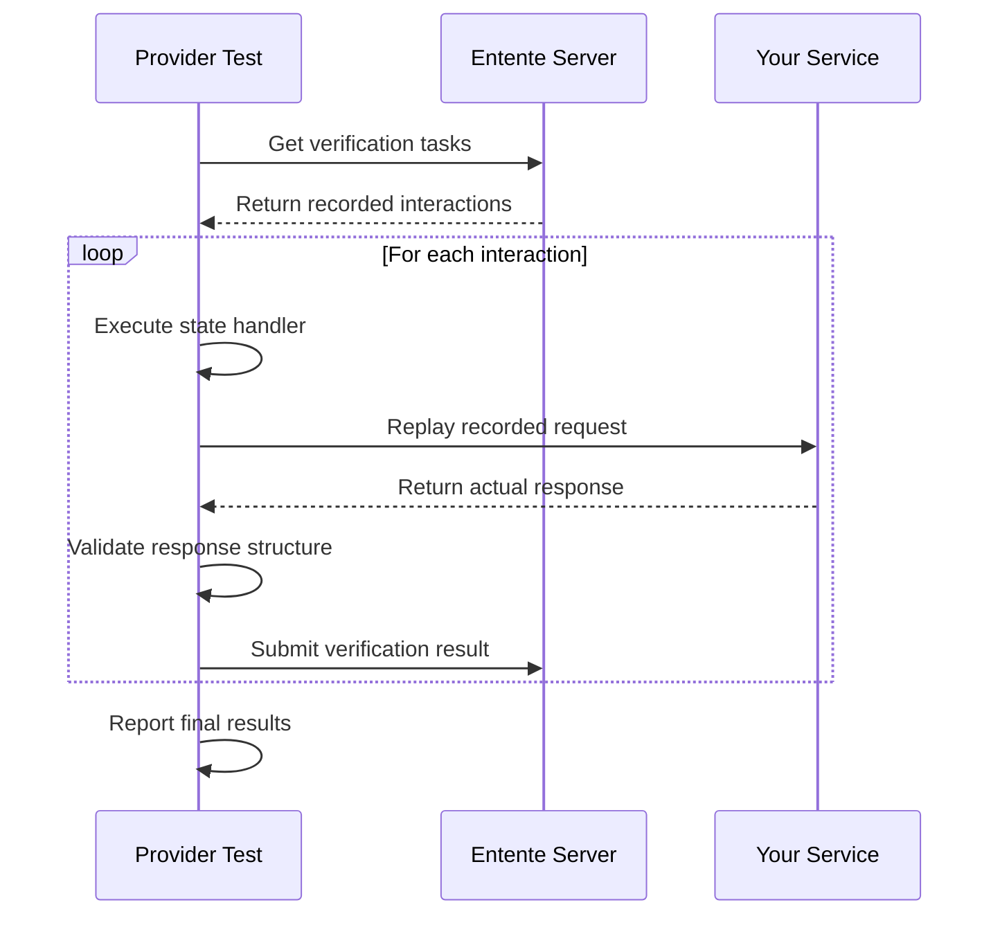

Provider verification is the core of Entente's contract testing. Instead of testing against mock data, providers verify their implementations against **real recorded interactions** from consumers.

## How Verification Works

The verification process follows these steps:



## Setting Up Verification

### Basic Provider Test

Here's a complete provider verification test from castle-service:

```typescript
// test/provider.test.ts
import { createProvider } from '@entente/provider'
import { serve } from '@hono/node-server'
import { afterEach, beforeEach, describe, expect, it } from 'vitest'
import { resetCastles } from '../src/db.js'
import app from '../src/index.js'

describe('Castle Service Provider Verification', () => {
  let server: ReturnType<typeof serve>
  const testPort = 4001

  beforeEach(async () => {
    // Reset test data to known state
    resetCastles()

    // Start your service on a test port
    server = serve({
      fetch: app.fetch,
      port: testPort,
    })

    // Give server time to start
    await new Promise(resolve => setTimeout(resolve, 100))
  })

  afterEach(async () => {
    // Clean shutdown
    if (server) {
      server.close()
      await new Promise(resolve => setTimeout(resolve, 100))
    }
  })

  it('should verify provider against recorded consumer interactions', async () => {
    const provider = createProvider({
      serviceUrl: process.env.ENTENTE_SERVICE_URL,
      apiKey: process.env.ENTENTE_API_KEY,
      provider: 'castle-service', // Your service name
    })

    const results = await provider.verify({
      baseUrl: `http://localhost:${testPort}`,
      environment: 'test', // Environment to verify against
      stateHandlers: {
        // Setup state for each operation
        listCastles: async () => {
          console.log('🔄 Resetting castles to default state')
          resetCastles()
        },
        getCastle: async () => {
          console.log('🔄 Resetting castles to default state')
          resetCastles()
        },
        createCastle: async () => {
          console.log('🔄 Resetting castles to default state')
          resetCastles()
        },
        deleteCastle: async () => {
          console.log('🔄 Resetting castles to default state')
          resetCastles()
        },
      },
      cleanup: async () => {
        // Cleanup after each interaction
        resetCastles()
      },
    })

    console.log('\n📊 Provider verification completed')
    console.log(`📋 Total interactions tested: ${results.results.length}`)

    const successfulResults = results.results.filter(r => r.success)
    const failedResults = results.results.filter(r => !r.success)

    console.log(`✅ Successful verifications: ${successfulResults.length}`)
    console.log(`❌ Failed verifications: ${failedResults.length}`)

    if (failedResults.length > 0) {
      console.log('\n❌ Failed verifications:')
      for (const result of failedResults) {
        console.log(`  - ${result.interactionId}: ${result.error}`)
      }
    }

    // All verifications should pass
    expect(failedResults.length).toBe(0)
  })
})
```

### Configuration Options

The `createProvider` function accepts these configuration options:

```typescript
const provider = createProvider({
  // Required: Entente server URL
  serviceUrl: 'https://entente.company.com',

  // Required: API key for authentication
  apiKey: process.env.ENTENTE_API_KEY,

  // Required: Your service name (must match registered name)
  provider: 'castle-service',

  // Optional: Your service version (defaults to package.json version)
  providerVersion: '0.1.0',
})
```

## State Handlers

State handlers are functions that prepare your service before each interaction is replayed. They're essential for deterministic testing.

### Operation-Based Handlers

Map state handlers to specific operations:

```typescript
const results = await provider.verify({
  baseUrl: 'http://localhost:4001',
  environment: 'test',
  stateHandlers: {
    // Handler for GET /castles
    'listCastles': async () => {
      await db.clearCastles()
      await db.insertCastles([
        { id: '1', name: 'Versailles', region: 'Île-de-France', yearBuilt: 1623 },
        { id: '2', name: 'Fontainebleau', region: 'Île-de-France', yearBuilt: 1137 }
      ])
    },

    // Handler for GET /castles/{id}
    'getCastle': async () => {
      await db.clearCastles()
      await db.insertCastle({
        id: '550e8400-e29b-41d4-a716-446655440000',
        name: 'Versailles',
        region: 'Île-de-France',
        yearBuilt: 1623
      })
    },

    // Handler for POST /castles
    'createCastle': async () => {
      // Ensure clean state for creation
      await db.clearCastles()
    },

    // Handler for DELETE /castles/{id}
    'deleteCastle': async () => {
      await db.clearCastles()
      await db.insertCastle({
        id: '550e8400-e29b-41d4-a716-446655440000',
        name: 'Versailles'
      })
    }
  }
})
```

### Dynamic State Setup

For more complex scenarios, you can inspect the interaction before setting up state:

```typescript
const results = await provider.verify({
  stateHandlers: {
    'getCastle': async (interaction) => {
      // Extract castle ID from the recorded request
      const castleId = interaction.request.path.split('/').pop()

      // Setup specific castle
      await db.insertCastle({
        id: castleId,
        name: 'Test Castle',
        region: 'Test Region',
        yearBuilt: 1500
      })
    }
  }
})
```

### Shared Setup Logic

You can create reusable setup functions:

```typescript
const setupDefaultCastles = async () => {
  await db.clearCastles()
  await db.insertCastles([
    { id: '1', name: 'Versailles', region: 'Île-de-France', yearBuilt: 1623 },
    { id: '2', name: 'Fontainebleau', region: 'Île-de-France', yearBuilt: 1137 }
  ])
}

const results = await provider.verify({
  stateHandlers: {
    'listCastles': setupDefaultCastles,
    'getCastle': setupDefaultCastles,
    'createCastle': async () => await db.clearCastles(),
    'deleteCastle': setupDefaultCastles
  }
})
```

## Response Validation

Entente validates provider responses against consumer expectations using sophisticated structure matching.

### What Gets Validated

**1. Status Codes Must Match Exactly**
```typescript
// Consumer recorded: 200
// Provider returns: 201
// Result: ❌ Failure - "Status code mismatch: expected 200, got 201"
```

**2. Response Structure Must Be Compatible**
```typescript
// Consumer expected:
{
  "id": "abc123",
  "name": "Versailles",
  "region": "Île-de-France"
}

// Provider returns:
{
  "id": "xyz789",           // ✅ Different value OK
  "name": "Fontainebleau",  // ✅ Different value OK
  "region": "Île-de-France", // ✅ Same value OK
  "yearBuilt": 1137        // ✅ Extra field OK
}
// Result: ✅ Success - structure matches, extra fields allowed
```

**3. Required Fields Must Be Present**
```typescript
// Consumer expected:
{
  "id": "abc123",
  "name": "Versailles",
  "region": "Île-de-France"
}

// Provider returns:
{
  "id": "xyz789",
  "name": "Fontainebleau"
  // ❌ Missing "region" field
}
// Result: ❌ Failure - "Missing required field: region"
```

**4. Field Types Must Match**
```typescript
// Consumer expected:
{
  "yearBuilt": 1623  // number
}

// Provider returns:
{
  "yearBuilt": "1623"  // string
}
// Result: ❌ Failure - "Type mismatch: expected number, got string"
```

### Array Validation

Arrays are validated structurally:

```typescript
// Consumer expected:
[
  { "id": "1", "name": "Versailles" },
  { "id": "2", "name": "Fontainebleau" }
]

// Provider returns:
[
  { "id": "3", "name": "Chambord", "yearBuilt": 1519 },
  { "id": "4", "name": "Chenonceau", "yearBuilt": 1515 },
  { "id": "5", "name": "Amboise", "yearBuilt": 1495 }
]
// Result: ✅ Success - array structure matches, different items OK
```

## Error Handling

### Handling Verification Failures

When verification fails, you get detailed error information:

```typescript
const results = await provider.verify(options)

const failedResults = results.results.filter(r => !r.success)

if (failedResults.length > 0) {
  console.log('\n❌ Failed verifications:')

  for (const result of failedResults) {
    console.log(`\nInteraction: ${result.interactionId}`)
    console.log(`Error: ${result.error}`)

    if (result.errorDetails) {
      console.log(`Field: ${result.errorDetails.field}`)
      console.log(`Expected: ${JSON.stringify(result.errorDetails.expected, null, 2)}`)
      console.log(`Actual: ${JSON.stringify(result.errorDetails.actual, null, 2)}`)
    }

    if (result.actualResponse) {
      console.log(`Status: ${result.actualResponse.status}`)
      console.log(`Response: ${JSON.stringify(result.actualResponse.body, null, 2)}`)
    }
  }
}
```

### Common Failure Patterns

**1. Missing State Setup**
```
Error: Request failed with status 404
Expected: 200
Actual: 404

Solution: Ensure state handler creates required test data
```

**2. Schema Mismatch**
```
Error: Response structure mismatch: Missing required field: region
Expected: {"id": "1", "name": "Versailles", "region": "Île-de-France"}
Actual: {"id": "1", "name": "Versailles"}

Solution: Ensure your API returns all fields consumers expect
```

**3. Type Incompatibility**
```
Error: Type mismatch: expected number, got string
Field: yearBuilt
Expected: 1623
Actual: "1623"

Solution: Ensure response field types match OpenAPI spec
```

## Performance Optimization

### Parallel Verification

By default, interactions are verified sequentially. For faster verification:

```typescript
// Note: Parallel verification requires careful state management
const results = await provider.verify({
  baseUrl: 'http://localhost:4001',
  environment: 'test',
  // Ensure each verification has isolated state
  stateHandlers: {
    'listCastles': async () => {
      // Use separate database/schema for this operation
      await db.useSchema(`test_${Date.now()}`)
      await setupCastles()
    }
  }
})
```

### Efficient State Management

Minimize state setup time:

```typescript
const results = await provider.verify({
  stateHandlers: {
    'listCastles': async () => {
      // ✅ Fast: Direct database operations
      await db.truncateTable('castles')
      await db.insertBatch(defaultCastles)
    },

    'getCastle': async () => {
      // ❌ Slow: Full application setup
      await resetEntireApplication()
      await runMigrations()
      await seedAllData()
    }
  }
})
```

## Environment Configuration

### Test Environment Setup

Configure different verification environments:

```typescript
const results = await provider.verify({
  baseUrl: 'http://localhost:4001',
  environment: process.env.NODE_ENV || 'test',
  stateHandlers: getStateHandlers(process.env.NODE_ENV)
})

function getStateHandlers(env: string) {
  if (env === 'test') {
    return {
      'listCastles': async () => await setupTestCastles()
    }
  } else if (env === 'integration') {
    return {
      'listCastles': async () => await setupIntegrationCastles()
    }
  }
  // ... etc
}
```

### Database Isolation

Use separate databases for verification:

```typescript
beforeEach(async () => {
  // Use test-specific database
  const testDb = `castle_service_test_${Date.now()}`
  await db.createDatabase(testDb)
  await db.useDatabase(testDb)
  await db.runMigrations()
})

afterEach(async () => {
  // Cleanup test database
  await db.dropCurrentDatabase()
})
```

## Next Steps

- **[State Management](/providers/state-management/)** - Advanced patterns for managing test state
- **[GitHub Actions](/providers/github-actions/)** - Integrate verification into your CI/CD pipeline
- **[Troubleshooting](/providers/troubleshooting/)** - Common issues and solutions

Provider verification ensures your implementation matches real consumer expectations. Invest time in comprehensive state handlers and your verification tests will catch integration issues before they reach production.